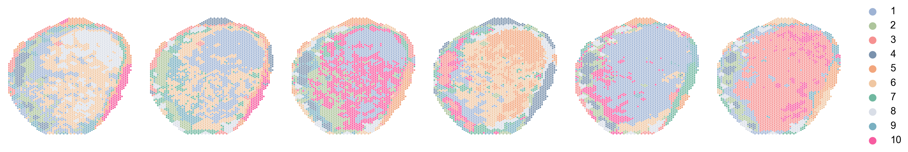

# Drawing for Nature's sub-journals 🐳




## Authors
Shiguan Mu, Jiaming Liang

## Resquirement
Users need to install R environment first.

How to install R: https://zhuanlan.zhihu.com/p/441227335

not need to install RStudio 

and the R install .exe download path: https://cran.r-project.org/

When you done installing R environment, you need to write some global environment parameters follow by: https://blog.csdn.net/qq_25881261/article/details/79669673

After that, Users can install all needed tools by this code:
```
pip install -r requirements.txt -i https://pypi.tuna.tsinghua.edu.cn/simple
```


<font color='red'>**Notion**</font>: 

Even if you set the R_Home, some running environment may meet `OSError: cannot load library`. If you meet this error, can set your own R_Home in code like `/4-size/size.ipynb` Cell 2.

Moreover, if you meet `UnicodeDecodeError: 'utf-8'`, you can open score code file `../site-packages/rpy2/rinterface_lib/conversion.py`, and change `_cchar_to_str` and `_cchar_to_str_with_maxlen` code block as follow:

```
def _cchar_to_str(c, encoding: str) -> str:
    # TODO: use isString and installTrChar
    s = ffi.string(c).decode(encoding)
    try:
        s = ffi.string(c).decode(encoding)
    except Exception as e:
        s = ffi.string(c).decode('GBK')
    return s


def _cchar_to_str_with_maxlen(c, maxlen: int, encoding: str) -> str:
    # TODO: use isString and installTrChar
    s = ffi.string(c, maxlen).decode(encoding)
    try:
        s = ffi.string(c, maxlen).decode(encoding)
    except Exception as e:
        s = ffi.string(c, maxlen).decode('GBK')
    return s
```

<font color='red'>**I hate R ! Fuck R !**</font>


## How to use them
Users can run the `.ipynb` files in each subdirectory to generate images. Each `.ipynb` will automatically set the directory at the same level as the file as the running directory, and select data according to the relative path and generate